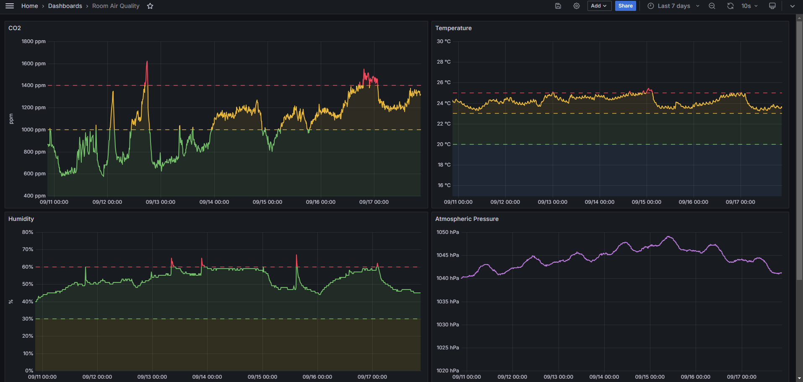

# aranet4-exporter

A Prometheus exporter for Aranet4.

## Preview

Example Grafana dashboard ([exported here](grafana.json))

## Usage

* Build using Go (`go build .`)
* Run and specify the device `./aranet4-exporter -addr 11:22:33:44:55:66`

Default user is `exporter` and password is `changeme`. Use `-authuser` and `-authpass` to customize.

## Metrics

* CO2 (`aranet4_co2_ppm`)
* Temperature (`aranet4_temperature_c`)
* Pressure (`aranet4_pressure_hpa`)
* Humidity (`aranet4_humidity_percent`)
* Battery (`aranet4_battery_percent`)

## License

This is free and unencumbered software released into the public domain. See the [UNLICENSE](UNLICENSE) file for more details.